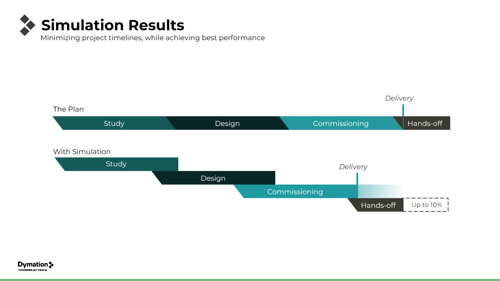

# 3D Simulation & Digital Twin Development

Portfolio of digital twin and automation projects for warehouse and 
intralogistics systems (2022-2026).

## Overview

This repository showcases my work in intralogistics and warehouse 
automation. I have worked on a variety of projects, including:
- AMR/AGV fleet optimization and simulation
- Digital twin and digital shadow implementations
- Virtual commissioning for robotic systems
- Data-driven performance optimization

## Key Achievements

- **90% reduction** in simulation development time (months → days)
- **20% efficiency gains** through continuous improvement projects
- **35+ production simulations** delivered across warehouse automation, fleet/traffic management, and robotics integration

## Featured Projects

### [1. Fleet Sizing & Optimization](./fleet-optimizzation/README.md)

Comprehensive fleet sizing and traffic management simulation for AMR deployments.

**Key Results:**
- Optimized fleet sizing and traffic management for AMR deployments
- Identified critical bottlenecks through heatmap analysis
- Reduced project commissioning time by up to 10%

 

### [2. Continuous Improvement Through Digital Shadow](./continuous-improvement/)

Real-time performance optimization using digital shadow technology.

**Key Results:**
- Validated simulation accuracy (±5% vs reality)
- Identified Hidden inefficiencies and bottlenecks
- Increased fleet efficiency by up to 20%
- Implemented data-driven traffic management

### [3. Virtual Commissioning for Robotic Integration](./robotic-integration/)

Digital twin for robot-conveyor integration with PLC synchronization.

**Key Results:**
- Achieved high precision in virtual-to-physical translation
- Ensured robot-conveyor synchronization with PLC
- Validated control logic before deployment
- Reduced FAT and SAT timeline

## Technical Approach

**Methodology:**
1. Real plant data analysis
2. Workflow implementation based on worst-case scenarios and stress testing
3. Traffic logic and job prioritization
4. KPI analysis and optimization
5. Validation and deployment

**Technologies & Concepts:**
- Digital Model, Digital Shadow, Digital Twin
- AMR/AGV simulation and fleet management
- Virtual commissioning
- PLC integration
- Performance analysis and optimization

## Note on Proprietary Work

All projects shown are based on professional work completed between 
2022-2025. Code is proprietary and cannot be shared. Documentation 
focuses on methodology, architecture, problem-solving approach, and 
achieved results.

---

*For more details on individual projects, see the README in each 
project folder.*

 

## Copyright & Usage

© 2022-2026 **Dymation**. All Rights Reserved.

This repository contains proprietary work completed during professional 
engagements. All content, documentation, methodologies, and media are 
provided for portfolio demonstration purposes only.

**Restrictions:**
- ❌ Code and methodologies may not be reproduced or used commercially
- ❌ Documentation and approaches may not be copied
- ✅ Viewing for evaluation purposes (e.g., by potential employers) is permitted
