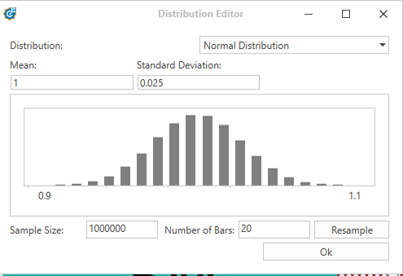
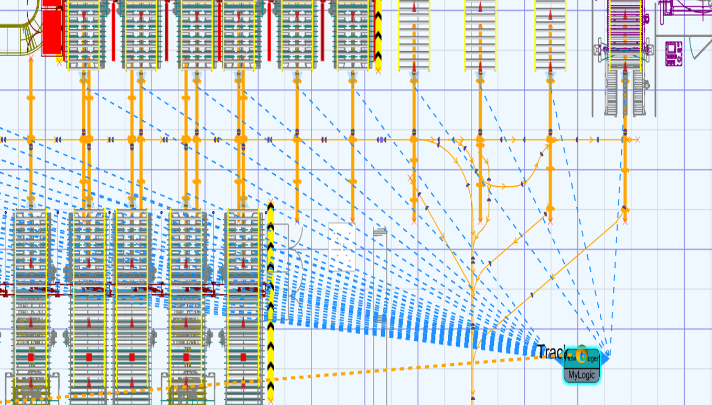
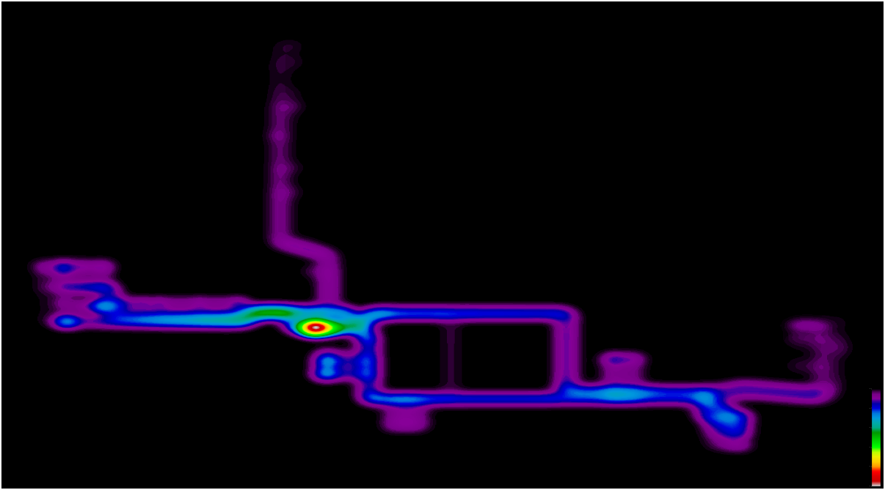

# Fleet Sizing & Optimization

Comprehensive fleet sizing and traffic management simulation for AMR deployments in warehouse automation.

---

## Project Overview

This project demonstrates the complete workflow for developing AMR fleet simulations, from initial layout setup to final optimization recommendations. The simulation enables data-driven decisions on fleet sizing, traffic management, and bottleneck identification before physical deployment.

**Duration:** 2022-2025  
**Projects Delivered:** 35+ production simulations  
**Domain:** Warehouse automation, intralogistics

---

## Key Results

- **90% reduction** in simulation development time (2-3 months → 1 week)
- Optimized fleet sizing for 35+ warehouse deployments
- Identified critical bottlenecks through heatmap analysis
- Reduced project commissioning time by up to 10%

---

## Simulation Development Process

### Step 1: Layout Import
Import warehouse CAD layout and establish coordinate system.

### Step 2: Station Configuration
- Import station list from customer data
- Position stations on layout (receiving, shipping, storage zones)
- Define station types and capacities

### Step 3: Workflow Integration
- Import workflow data from Excel (pick-to-drop pairs)
- Configure workflow frequencies based on real operational data
- Define time windows and random distributaion scenarios with peak demand

 

**Example workflow data:**
| Workflow | Frequency (trips/hour) | Pick Station | Drop Station |
|----------|------------------------|--------------|--------------|
| A→B      | 3.02                   | Receiving A  | Shipping B   |
| A→C      | 1.03                   | Receiving A  | Storage C    |

### Step 4: Fleet Configuration
- Add AMR/AGV vehicles with realistic specifications
- Configure charging stations and parking zones
- Set battery management parameters

### Step 5: Path Network Definition
- Create navigation paths connecting all stations
- Define intersection points and traffic zones
- Ensure full connectivity across warehouse

---

## Automation & Process Improvements

### The Challenge
**Original process:** Manual configuration for each simulation took **months**
- Repetitive station and workflow setup
- Manual path creation for each layout
- Custom scripting for every project
- No reusable components

### The Solution: Automated Framework

#### 1. Pre-Programmed Controller
Created reusable controller that automates:
- **Automatic workflow import** from Excel files
- Workflow-to-station assignment
- Frequency distribution based on demand data

**Impact:** Workflow setup reduced from 2 weeks → 1 day

#### 2. Battery Management System
Built-in logic for:
- Automatic battery monitoring
- Smart charging station assignment
- Opportunistic charging during idle periods
- Low-battery emergency handling

**Impact:** No manual battery logic required per project

#### 3. Task Management System
Intelligent job assignment:
- Dynamic vehicle-to-task allocation
- Priority-based job queuing
- Load balancing across fleet
- Deadlock prevention

**Impact:** Traffic flow optimization built-in

#### 4. Pre-Defined Traffic Zones
Reusable traffic logic templates:
- Intersection management (right-of-way, priority)
- Zone-based speed control
- Congestion detection and rerouting
- Safety zone enforcement

**Impact:** Traffic logic configuration reduced from 3 weeks → 2 days

### Overall Time Savings

| Phase | Before | After | Improvement |
|-------|--------|-------|-------------|
| **Workflow Setup** | 2 weeks | 1 day | 93% ⬇️ |
| **Traffic Logic** | 3 weeks | 2 days | 90% ⬇️ |
| **Vehicle Config** | 1 week | 2 hours | 97% ⬇️ |
| **Total Development** | 2-3 months | 1 week | **90%** ⬇️ |

 

---

## Simulation Results & Analysis

### Fleet Sizing Analysis

The simulation tests multiple fleet configurations to determine optimal sizing:

| Fleet Size | Throughput (pallets/hour) | Fleet Saturation | Assessment |
|------------|---------------------------|------------------|------------|
| 4 vehicles | 44.43 | 99.99% | ❌ Over-saturated |
| 5 vehicles | 50.9 | 97.59% |  ⚠️ Slightly over-saturated |
| 6 vehicles | 50.9 | 90.07% | ✅ **Optimal** |

**Recommendation:** 6-vehicle fleet provides optimal balance between throughput and saturation.

### Workflow Satisfaction

Analysis of whether demand can be met:
- **Target throughput:** 50.9 pallets/hour
- **Achieved throughput:** 50.9 pallets/hour
- **Workflow satisfaction:** 100% (all workflows completed within time requirements)

### Heatmap Analysis

Traffic heatmaps reveal congestion zones and bottlenecks:

**Key findings:**
- **Hot zones (red):** High traffic density at narrow corridor on the left side of the warehouse
- **Congestion points:** The entrace of two narrow corridors
- **Recommendations:** create a new job queue for the corridor and reduce vehicle presence near the entrance

### Key Performance Indicators

**Throughput:**
- Pallets handled per hour
- Mission completion rate
- Average cycle time

**Fleet Performance:**
- Vehicle utilization percentage
- Idle time analysis
- Battery consumption patterns

**Traffic Efficiency:**
- Average travel distance
- Wait time at intersections
- Deadlock occurrences: 0

---

## Project Deliverables

For each simulation project, clients receive:

1. **Simulation Model** - Fully configured and validated
2. **Fleet Sizing Report** - Recommendations with data
3. **Heatmap Analysis** - Bottleneck identification
4. **KPI Dashboard** - Performance metrics
5. **Video Demonstrations** - Visual validation

---

## Simulation Overview

 

---

## Technologies Used

- **Simulation Platform:** 3D simulation software with physics engine
- **Programming:** C# for custom logic and automation
- **Data Integration:** Excel-based workflow import
- **Visualization:** Real-time 3D visualization with heatmap overlays
- **Analytics:** Custom KPI tracking and reporting tools

---

## Lessons Learned

### What Worked Well
- Automation framework dramatically reduced development time
- Reusable components enabled consistent quality across projects
- Excel-based workflow import made client data integration seamless

### Challenges Overcome
- Balancing simulation accuracy with performance
- Creating flexible traffic logic that works for various layouts
- Ensuring battery management logic handles edge cases

### Future Improvements
- Further automation of path network generation
- Machine learning for optimal traffic zone configuration
- Integration with digital twin for real-time validation

---

## Note on Proprietary Work

This project was completed during professional work at Dymation (2022-2025). All proprietary code and client information has been removed or anonymized. Documentation focuses on methodology, architecture, and achieved results.

*Return to [main portfolio](../README.md) | View [other projects](../README.md#featured-projects)*

---

© 2022-2025 Mohammad Bahrami. All Rights Reserved.